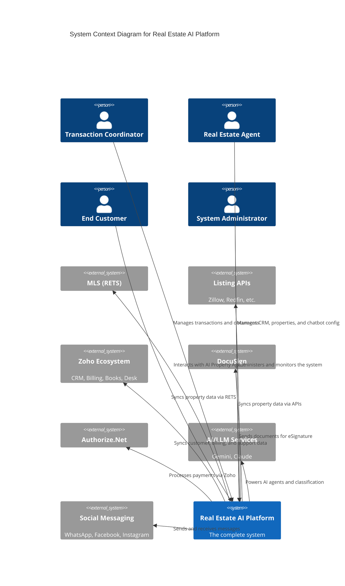
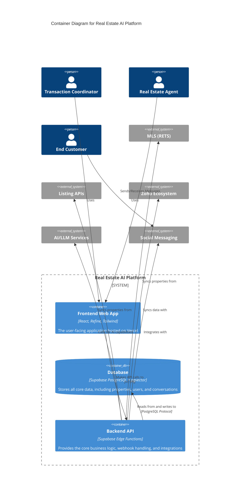

# 03. System Architecture

This document provides a high-level overview of the system architecture using the C4 model. It includes context and container diagrams to illustrate the system's components and their interactions.

## C4 Model: Level 1 - System Context Diagram

This diagram shows the system in its environment, including the key user personas and external systems it interacts with.

## C4-Model: Level 2 - Container Diagram

This diagram zooms into the system, showing the high-level containers (applications and data stores) that make up the platform.

