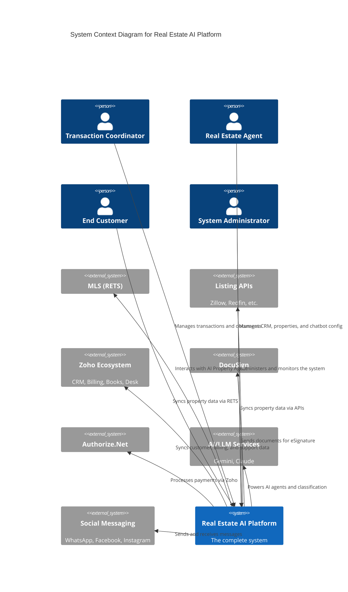
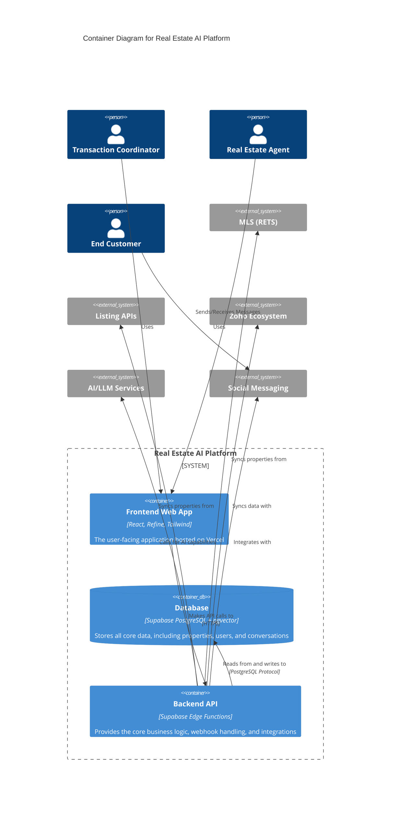
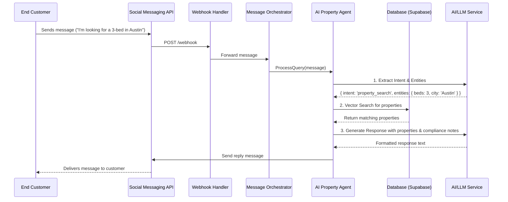

# 03. System Architecture

This document provides a high-level overview of the system architecture using the C4 model. It includes context and container diagrams to illustrate the system's components and their interactions.

## C4 Model: Level 1 - System Context Diagram

This diagram shows the system in its environment, including the key user personas and external systems it interacts with.



## C4-Model: Level 2 - Container Diagram

This diagram zooms into the system, showing the high-level containers (applications and data stores) that make up the platform.




## C4-Model: Level 3 - Component Diagram (Backend API)

This diagram breaks down the `Backend API` container into its key components, which are implemented as Supabase Edge Functions.

```mermaid
C4Component
  title Component Diagram for Backend API

  Container(frontend, "Frontend Web App")
  ContainerDb(db, "Database")
  System_Ext(social, "Social Messaging APIs")
  System_Ext(llm, "AI/LLM Services")
  System_Ext(mls, "MLS/RETS Service")

  System_Boundary(api, "Backend API (Supabase Edge Functions)") {
    Component(auth_handler, "Auth Handler", "Deno/TypeScript", "Handles user authentication and JWT validation")
    Component(webhook_handler, "Webhook Handler", "Deno/TypeScript", "Receives incoming webhooks from social channels (WhatsApp, etc.)")
    Component(message_orchestrator, "Message Orchestrator", "Deno/TypeScript", "Routes incoming messages to the AI Property Agent")
    Component(ai_agent, "AI Property Agent", "Deno/TypeScript", "Processes queries, performs vector search, and generates responses")
    Component(property_ingestor, "Property Ingestor", "Deno/TypeScript", "Scheduled function to sync properties from MLS/APIs")
    Component(zoho_sync, "Zoho Sync", "Deno/TypeScript", "Syncs data with Zoho CRM, Billing, and Desk")
  }

  Rel(frontend, auth_handler, "Authenticates user")
  Rel(social, webhook_handler, "Sends incoming messages")
  Rel(webhook_handler, message_orchestrator, "Forwards message for processing")
  Rel(message_orchestrator, ai_agent, "Invokes agent to handle query")
  Rel(ai_agent, db, "Reads property data and vector embeddings")
  Rel(ai_agent, llm, "Calls for NLU and response generation")
  Rel(ai_agent, social, "Sends response back to user")
  Rel(property_ingestor, mls, "Fetches new listings")
  Rel(property_ingestor, db, "Writes property data and embeddings")
  Rel(api, zoho_sync, "Syncs data periodically")
```

## Sequence Diagram: AI Chatbot Interaction

This diagram illustrates the sequence of events when an end customer sends a message to the AI Property Agent.


