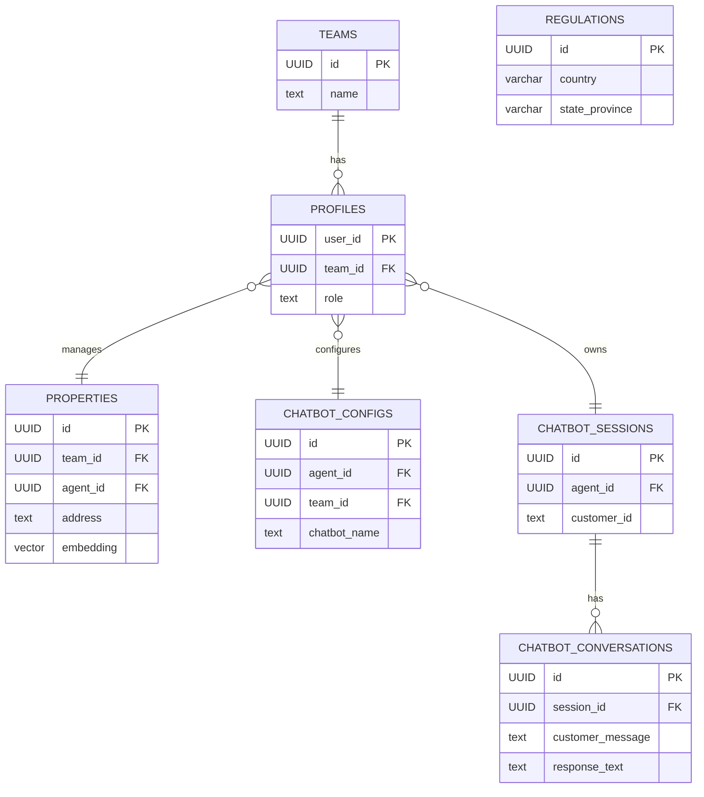

# 06. Database Schema

This document defines the PostgreSQL database schema for the Real Estate Transaction Coordinator + Agent CRM platform, implemented on Supabase. It includes an Entity-Relationship Diagram (ERD) and detailed SQL definitions for all core tables, covering multi-tenancy, property management, AI chatbot functionality, and regulatory compliance.

## Entity-Relationship Diagram (ERD)

This diagram provides a visual overview of the relationships between the core tables in the database.




## 6.1 Core Tables (PostgreSQL via Supabase)

### Multi-Tenancy and Users

These tables form the foundation of the platform's multi-tenant architecture.

**`teams`**

Represents a brokerage or a group of agents, which is the primary tenancy unit.

```sql
CREATE TABLE teams (
  id UUID PRIMARY KEY DEFAULT gen_random_uuid(),
  name TEXT NOT NULL,
  created_at TIMESTAMP WITH TIME ZONE DEFAULT timezone('utc'::text, now()) NOT NULL
);
```

**`profiles`**

Stores user-specific information and links a user from `auth.users` to a `team`.

```sql
CREATE TABLE profiles (
  user_id UUID PRIMARY KEY REFERENCES auth.users(id) ON DELETE CASCADE,
  team_id UUID REFERENCES teams(id) ON DELETE SET NULL,
  role TEXT NOT NULL DEFAULT 'agent', -- 'agent', 'team_admin'
  full_name TEXT,
  avatar_url TEXT,
  updated_at TIMESTAMP WITH TIME ZONE DEFAULT timezone('utc'::text, now()) NOT NULL
);
```


### Property Management

**`properties`**

Stores all property listings, whether entered manually, synced from an MLS via RETS, or aggregated from third-party APIs.

```sql
CREATE TABLE properties (
  id UUID PRIMARY KEY DEFAULT gen_random_uuid(),
  team_id UUID NOT NULL REFERENCES teams(id),
  agent_id UUID NOT NULL REFERENCES users(id),
  
  -- Basic info
  address TEXT NOT NULL,
  latitude DECIMAL(9,6),
  longitude DECIMAL(9,6),
  property_type VARCHAR(50), -- 'residential', 'commercial', 'land'
  bedrooms INT,
  bathrooms DECIMAL(3,1),
  square_feet INT,
  year_built INT,
  
  -- Listing info
  list_price DECIMAL(12,2),
  status VARCHAR(20) NOT NULL DEFAULT 'active', -- 'active', 'pending', 'sold', 'withdrawn'
  list_date DATE,
  close_date DATE,
  
  -- Source & sync
  source VARCHAR(50) NOT NULL, -- 'manual', 'mls', 'api'
  external_id TEXT, -- MLS ID, Zillow ID, etc.
  source_sync_date TIMESTAMP WITH TIME ZONE,
  
  -- Description & photos
  description TEXT,
  photo_urls TEXT[], -- JSON array of URLs
  
  -- Vector embedding for semantic search
  embedding vector(1536), -- OpenAI/Gemini embeddings dimension
  
  -- Enrichment data
  enrichment_data JSONB, -- zoning, flood_zone, tax_estimate, financing_programs, etc.
  
  created_at TIMESTAMP WITH TIME ZONE DEFAULT timezone('utc'::text, now()) NOT NULL,
  updated_at TIMESTAMP WITH TIME ZONE DEFAULT timezone('utc'::text, now()) NOT NULL,
  is_archived BOOLEAN DEFAULT false
);

CREATE INDEX ON properties USING IVFFLAT (embedding vector_cosine_ops);
CREATE INDEX ON properties(team_id, agent_id);
CREATE INDEX ON properties(external_id, source);
```

### Regulations & Jurisdictional Rules

**`regulations`**

Stores regulatory requirements, disclosure laws, and financing rules keyed by jurisdiction. This data is used by the AI Chat Agent to ensure compliant recommendations.

```sql
CREATE TABLE regulations (
  id UUID PRIMARY KEY DEFAULT gen_random_uuid(),
  country VARCHAR(2) NOT NULL, -- 'US', 'CA', 'MX'
  state_province VARCHAR(2), -- 'CA', 'TX', 'ON'
  city VARCHAR(100),
  region TEXT,
  
  -- Disclosure & compliance rules
  required_disclosures TEXT[], -- e.g., ['lead_paint', 'water_damage', 'hoa_status']
  financing_restrictions JSONB, -- FHA, VA, conventional rules
  
  -- Environmental
  flood_zone_disclosure BOOLEAN,
  wildfire_risk_disclosure BOOLEAN,
  earthquake_disclosure BOOLEAN,
  
  -- Tax & financial
  property_tax_formula TEXT, -- how to calculate estimate
  hoa_allowed BOOLEAN,
  condo_financing_restrictions JSONB,
  
  -- Brokerage practices
  broker_commission_disclosure_required BOOLEAN,
  dual_agency_allowed BOOLEAN,
  
  -- Custom fields per jurisdiction
  custom_rules JSONB,
  
  created_at TIMESTAMP WITH TIME ZONE DEFAULT timezone('utc'::text, now()) NOT NULL,
  updated_at TIMESTAMP WITH TIME ZONE DEFAULT timezone('utc'::text, now()) NOT NULL
);
```

### Chatbot Configuration & Sessions

**`chatbot_configs`**

Allows agents and brokerages to configure the personality, rules, and channel presence of their AI Property Agent.

```sql
CREATE TABLE chatbot_configs (
  id UUID PRIMARY KEY DEFAULT gen_random_uuid(),
  agent_id UUID NOT NULL REFERENCES users(id),
  team_id UUID NOT NULL REFERENCES teams(id),
  
  -- Profile
  chatbot_name VARCHAR(100),
  chatbot_avatar_url TEXT,
  bio TEXT,
  languages TEXT[] DEFAULT '{"en"}', -- ['en', 'es', 'pt']
  
  -- Personality & policies
  tone VARCHAR(50) DEFAULT 'professional', -- 'professional', 'friendly', 'assertive'
  availability_hours JSONB, -- e.g. {"mon": "9am-5pm", "sat": "disabled"}
  off_hours_response TEXT,
  
  -- Filters & rules
  property_price_min DECIMAL(12,2),
  property_price_max DECIMAL(12,2),
  property_types VARCHAR(50)[],
  geographic_focus JSONB, -- {'cities': ['Austin', 'Dallas'], 'radius_miles': 25}
  financing_preferences TEXT[], -- 'no_cash_only', 'fha_eligible', etc.
  
  -- Escalation rules
  escalation_triggers TEXT[], -- phrases that trigger human handoff
  
  -- Channel configuration
  whatsapp_enabled BOOLEAN DEFAULT false,
  whatsapp_number VARCHAR(20),
  facebook_enabled BOOLEAN DEFAULT false,
  facebook_page_id TEXT,
  instagram_enabled BOOLEAN DEFAULT false,
  instagram_account_id TEXT,
  website_widget_enabled BOOLEAN DEFAULT false,
  website_domain TEXT,
  
  -- Widget styling
  widget_styling JSONB, -- colors, logo, welcome message
  
  created_at TIMESTAMP WITH TIME ZONE DEFAULT timezone('utc'::text, now()) NOT NULL,
  updated_at TIMESTAMP WITH TIME ZONE DEFAULT timezone('utc'::text, now()) NOT NULL
);
```

**`chatbot_sessions`**

Tracks individual conversations between an end customer and an AI Property Agent across all channels.

```sql
CREATE TABLE chatbot_sessions (
  id UUID PRIMARY KEY DEFAULT gen_random_uuid(),
  agent_id UUID NOT NULL REFERENCES users(id),
  team_id UUID NOT NULL REFERENCES teams(id),
  
  -- Customer identity (hashed for privacy)
  customer_id TEXT NOT NULL,
  channel VARCHAR(50) NOT NULL, -- 'whatsapp', 'facebook', 'instagram', 'website'
  external_message_id TEXT, -- WhatsApp/FB message ID
  
  -- Context
  context_json JSONB, -- learned preferences, conversation history
  last_message_at TIMESTAMP WITH TIME ZONE,
  is_active BOOLEAN DEFAULT true,
  
  created_at TIMESTAMP WITH TIME ZONE DEFAULT timezone('utc'::text, now()) NOT NULL
);
```

**`chatbot_conversations`**

Logs every message pair (customer query and chatbot response) for auditing, analytics, and fine-tuning.

```sql
CREATE TABLE chatbot_conversations (
  id UUID PRIMARY KEY DEFAULT gen_random_uuid(),
  session_id UUID NOT NULL REFERENCES chatbot_sessions(id),
  
  customer_message TEXT,
  intent VARCHAR(100), -- 'property_search', 'market_insight', 'financial_guidance'
  intent_confidence DECIMAL(3,2),
  
  -- Chatbot response
  properties_recommended UUID[], -- REFERENCES properties(id)
  response_text TEXT,
  regulatory_notes TEXT,
  
  -- Metadata
  latency_ms INT,
  ai_model VARCHAR(50), -- 'gemini-pro', 'claude-3'
  
  created_at TIMESTAMP WITH TIME ZONE DEFAULT timezone('utc'::text, now()) NOT NULL
);
```

**`chatbot_analytics`**

Aggregated daily analytics for chatbot performance and usage.

```sql
CREATE TABLE chatbot_analytics (
  id UUID PRIMARY KEY DEFAULT gen_random_uuid(),
  agent_id UUID,
  team_id UUID,
  date DATE NOT NULL,
  
  total_sessions INT,
  total_messages INT,
  avg_response_time_ms DECIMAL(8,2),
  properties_recommended_count INT,
  handoff_to_human_count INT,
  customer_satisfaction_score DECIMAL(3,2),
  
  created_at TIMESTAMP WITH TIME ZONE DEFAULT timezone('utc'::text, now()) NOT NULL
);
```

### Message Queue

**`message_queue`**

A central queue for handling inbound and outbound messages across all communication channels (WhatsApp, Facebook, etc.) to ensure reliable, asynchronous delivery.

```sql
CREATE TABLE message_queue (
  id UUID PRIMARY KEY DEFAULT gen_random_uuid(),
  session_id UUID REFERENCES chatbot_sessions(id),
  
  direction VARCHAR(20) NOT NULL, -- 'inbound', 'outbound'
  channel VARCHAR(50) NOT NULL,
  
  message_text TEXT,
  media_urls TEXT[],
  
  status VARCHAR(20) NOT NULL DEFAULT 'pending', -- 'pending', 'sent', 'delivered', 'failed'
  error_message TEXT,
  
  external_message_id TEXT,
  
  created_at TIMESTAMP WITH TIME ZONE DEFAULT timezone('utc'::text, now()) NOT NULL,
  sent_at TIMESTAMP WITH TIME ZONE
);
```
