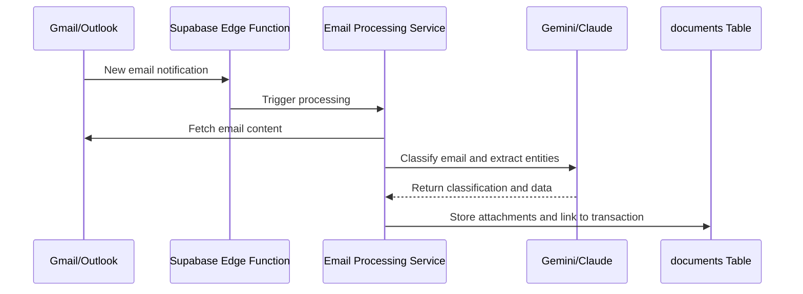

# Email (Gmail/Outlook) Integration Runbook

This document describes the integration with Gmail and Outlook for the Smart Inbox feature, which involves email ingestion, routing, and classification.

## 1. Architecture

The integration allows Transaction Coordinators (TCs) to connect their professional email accounts (Gmail or Outlook) to the platform. The platform will then monitor the inbox for new emails related to transactions, classify them, and surface relevant information and documents within the application.

## 2. Authentication

-   **OAuth 2.0**: The platform will use OAuth 2.0 to securely connect to the user's email account. The user will be redirected to a consent screen to grant the necessary permissions.
-   **Permissions**: The application will request the minimum required permissions, such as `gmail.readonly` for Gmail or `Mail.Read` for Outlook.
-   **Token Storage**: OAuth tokens (access and refresh tokens) will be encrypted and stored securely, associated with the user's profile.

## 3. Email Ingestion

### Gmail

-   **Push Notifications**: The Gmail API's push notification feature will be used to receive real-time notifications of new emails. A webhook will be configured to point to a Supabase Edge Function.
-   **History Sync**: For initial setup and to handle any missed push notifications, the platform will periodically sync the user's inbox using the `history.list` method.

### Outlook

-   **Microsoft Graph Notifications**: Similar to Gmail, Microsoft Graph provides webhook notifications for new mail.
-   **Delta Queries**: For synchronization, the platform will use delta queries to fetch only the changes since the last sync.

## 4. Processing Flow

## 5. AI-Powered Classification

-   An AI model (Gemini or Claude) will be used to classify incoming emails into categories such as "Inspection Report," "Offer Letter," or "Closing Document."
-   The model will also extract key entities like party names, dates, and amounts.
-   This structured data will be used to automate tasks, such as creating deadlines or updating transaction details.
