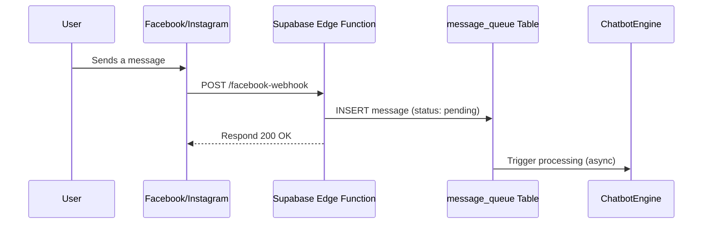

# Facebook Messenger & Instagram DM Integration Runbook

This document outlines the integration with the Facebook Graph API to support messaging on both Facebook Messenger and Instagram Direct Messages.

## 1. Prerequisites

- A Facebook Page for the business.
- An Instagram Business Account, linked to the Facebook Page.
- Administrator access to the Facebook Page.

## 2. Setup and Configuration

### Step 1: App Setup

1.  Use the same Meta App created for the WhatsApp integration.
2.  From the app dashboard, add the **Messenger** and **Instagram** products.

### Step 2: Configure Webhook

1.  In the **Messenger** settings, configure the webhook:
    -   **Callback URL**: `https://<your-project-subdomain>.supabase.co/functions/v1/facebook-webhook`
    -   **Verify Token**: Use a secure token stored in Supabase Secrets (`FACEBOOK_VERIFY_TOKEN`).
2.  Subscribe to the `messages` and `messaging_postbacks` webhook events for the Facebook Page.
3.  For Instagram, ensure the `instagram_basic` and `instagram_manage_messages` permissions are granted.

### Step 3: Obtain API Credentials

1.  Generate a **Page Access Token** for your Facebook Page. This token is used to send messages.
2.  Store the token securely in Supabase Secrets (`FACEBOOK_PAGE_ACCESS_TOKEN`).

## 3. Message Handling

### Inbound Message Flow

### Outbound Message Flow

-   **Endpoint**: `https://graph.facebook.com/v18.0/me/messages`
-   **Headers**:
    -   `Authorization: Bearer {FACEBOOK_PAGE_ACCESS_TOKEN}`
    -   `Content-Type: application/json`
-   **Body**: A JSON object specifying the recipient (`id`), the message content, and the messaging type.

## 4. Platform-Specific Features

-   **Facebook Messenger**: Supports rich UI elements like carousels and persistent menus, which can be used to display multiple properties or provide quick access to common actions.
-   **Instagram DMs**: Has a more limited UI. Responses should be concise and primarily text-based. The main goal on Instagram is often to drive the user to a more feature-rich channel like the website or WhatsApp.
