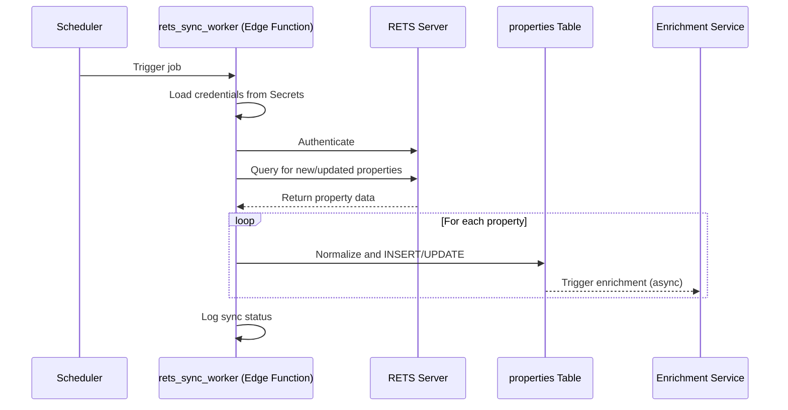

# MLS Integration (RETS) Runbook

This document provides a guide for integrating with Multiple Listing Service (MLS) data providers using the Real Estate Transaction Standard (RETS).

## 1. Overview

RETS is a common standard for accessing property listing data from MLS providers. The integration involves a scheduled job that connects to a RETS server, downloads new and updated listings, and ingests them into the platform's `properties` table.

## 2. Setup

1.  **Credentials**: The brokerage must provide their RETS server credentials, which typically include:
    -   RETS Server URL
    -   Username
    -   Password
2.  **Storage**: These credentials must be stored securely in Supabase Secrets, associated with the agent's or team's account.
3.  **Scheduling**: A Supabase Scheduled Function (`rets_sync_worker`) is configured to run at a regular interval (e.g., daily or hourly) for each team that has enabled RETS integration.

## 3. Sync Flow

The synchronization process is executed by the `rets_sync_worker` function.

## 4. RETS Querying

The worker function will execute a query against the RETS server to fetch properties. The query should be structured to only pull changes since the last successful sync.

-   **Query Language**: DMQL (Data Mining Query Language)
-   **Example Query**: `(LastModified=2025-12-18T10:00:00Z+)` - this fetches all properties modified since the specified timestamp.

## 5. Field Mapping

A mapping must be defined between the RETS fields and the columns in the `properties` table. This mapping can vary between MLS providers, so it should be configurable.

| RETS Field            | `properties` Column | Notes                                      |
| --------------------- | ------------------- | ------------------------------------------ |
| `ListingID`           | `external_id`       | The unique ID from the MLS.                |
| `StreetAddress`       | `address`           |                                            |
| `ListPrice`           | `list_price`        |                                            |
| `BedroomsTotal`       | `bedrooms`          |                                            |
| `BathroomsTotal`      | `bathrooms`         |                                            |
| `LivingArea`          | `square_feet`       |                                            |
| `YearBuilt`           | `year_built`        |                                            |
| `ListingStatus`       | `status`            | Map to standard status values.             |
| `PublicRemarks`       | `description`       |                                            |
| `Photos`              | `photo_urls`        | An array of photo URLs.                    |

## 6. Error Handling

-   **Authentication Failures**: If the worker cannot authenticate to the RETS server, an alert should be sent to the brokerage admin to verify their credentials.
-   **Sync Failures**: If the sync job fails, it should be retried automatically. After a configurable number of failed retries, the job should be disabled and an alert sent to the system administrator.
