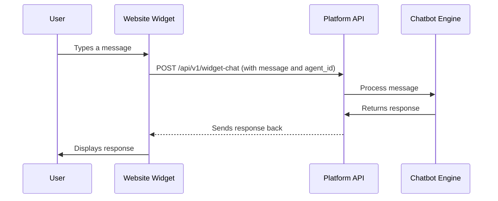

# Website Widget Integration Runbook

This document describes how to implement and deploy the embeddable website widget for the AI Property Agent.

## 1. Architecture

The widget is a lightweight, self-contained web application, likely built as a [Web Component](https://developer.mozilla.org/en-US/docs/Web/API/Web_components) or using a framework like React, and then compiled into a single JavaScript file.

It communicates with the backend via a dedicated API endpoint, which in turn interacts with the Chatbot Engine.

## 2. Deployment

1.  The widget's JavaScript code is hosted on a publicly accessible URL, served from the platform's main domain (e.g., `https://yourdomain.com/widget.js`).
2.  Brokerages embed the widget on their website by adding a `<script>` tag and a placeholder `<div>` element:

    ```html
    <script src="https://yourdomain.com/widget.js" defer></script>
    <div id="property-chat-widget" data-agent-id="<AGENT_UUID>"></div>
    ```

    The `data-agent-id` attribute is crucial for associating the widget instance with the correct agent's chatbot configuration.

## 3. Communication Flow



## 4. Styling and Customization

The widget's appearance can be customized by the brokerage to match their brand.

-   Customization options (colors, logo, welcome message) are stored in the `chatbot_configs.widget_styling` JSONB column.
-   When the widget loads, it fetches its configuration from the API using the `agent_id` and applies the custom styles dynamically.

## 5. Security Considerations

-   **CORS**: The API endpoint for the widget must have Cross-Origin Resource Sharing (CORS) enabled to allow requests from the brokerage's domain.
-   **Authentication**: The widget operates in an unauthenticated context from the end-user's perspective. The `agent_id` is public. All sensitive operations are handled by the authenticated backend.
