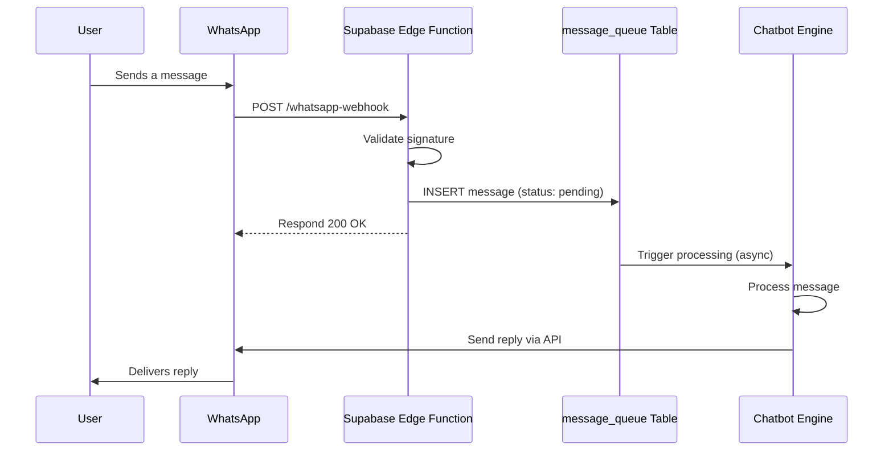

# WhatsApp Business API (Native Meta) Integration Runbook

This document provides a step-by-step guide for integrating the platform with the WhatsApp Business API, using the native integration provided by Meta.

## 1. Prerequisites

- A Meta Business Account.
- A verified business phone number that is not associated with an existing WhatsApp account.
- Administrator access to the Meta Business Account.

## 2. Setup and Configuration

### Step 1: Create a WhatsApp Business App

1.  Navigate to the [Meta for Developers](https://developers.facebook.com/) portal.
2.  Go to **My Apps** and click **Create App**.
3.  Select **Business** as the app type.
4.  Provide an app name (e.g., "Real Estate AI Agent") and link it to your Meta Business Account.
5.  From the app dashboard, find **WhatsApp** and click **Set up**.

### Step 2: Configure Webhook

1.  In the WhatsApp configuration section, find the **Webhooks** settings.
2.  Click **Edit** and configure the webhook:
    -   **Callback URL**: `https://<your-project-subdomain>.supabase.co/functions/v1/whatsapp-webhook`
    -   **Verify Token**: Generate a secure, random string and store it as a secret in Supabase (`WHATSAPP_VERIFY_TOKEN`). Enter this token here.
3.  Subscribe to the following webhook events:
    -   `messages`
    -   `message_status`
    -   `message_template_status_update`

### Step 3: Obtain API Credentials

1.  From the WhatsApp API settings page, you will find:
    -   **Phone Number ID**: The unique ID for your business phone number.
    -   **WhatsApp Business Account ID**: The ID for your overall business account.
2.  Generate a permanent **Access Token**. This token is used to authenticate API requests. Store it securely in Supabase Secrets (`WHATSAPP_ACCESS_TOKEN`).

## 3. Message Handling

### Inbound Message Flow

The sequence diagram below illustrates the flow of an inbound message from a user on WhatsApp to the platform.

### Outbound Message Flow

To send a message, the Chatbot Engine makes a `POST` request to the Meta Graph API.

-   **Endpoint**: `https://graph.facebook.com/v18.0/{phone_number_id}/messages`
-   **Headers**:
    -   `Authorization: Bearer {WHATSAPP_ACCESS_TOKEN}`
    -   `Content-Type: application/json`
-   **Body**: A JSON object containing the recipient's phone number and the message content (text, template, image, etc.).

## 4. Error Handling and Retries

-   **Webhook Failures**: If the Supabase webhook function is down, Meta will retry sending the webhook for up to 24 hours.
-   **Message Processing Failures**: If the `ChatbotEngine` fails to process a message, the message in the `message_queue` will be marked as `failed`. A background worker should retry processing failed messages with an exponential backoff strategy (up to 3 retries).
-   **API Rate Limits**: The Meta API has rate limits (e.g., 60 messages/second). The `MessageQueue` should be processed by a worker that respects these rate limits to avoid being throttled.

## 5. Testing

-   Use the **Test Phone Number** provided in the WhatsApp API setup page in the Meta for Developers portal to send test messages and verify the webhook integration.
-   Create a suite of automated tests that simulate various message types (text, images, location) and user intents.
