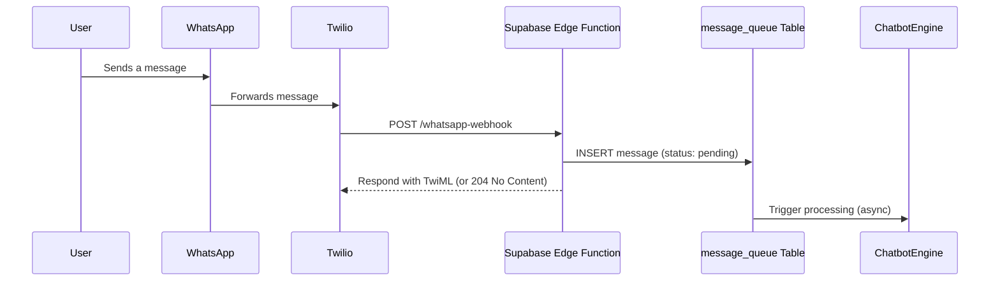

# WhatsApp Business API (Twilio Fallback) Integration Runbook

This document provides a guide for using the Twilio API for WhatsApp as a fallback integration, should the native Meta API be unavailable.

## 1. Prerequisites

- A Twilio account with a funded balance.
- A Twilio phone number enabled for WhatsApp.
- Administrator access to the Twilio account.

## 2. Setup and Configuration

### Step 1: Enable WhatsApp on a Twilio Number

1.  In the Twilio Console, navigate to **Messaging > Senders > WhatsApp Senders**.
2.  Follow the instructions to enable WhatsApp on a new or existing Twilio phone number. This involves linking your Twilio account to a Facebook Business Manager.

### Step 2: Configure Webhook

1.  In the settings for your WhatsApp-enabled number, find the **"A MESSAGE COMES IN"** webhook configuration.
2.  Set the webhook URL to the same Supabase Edge Function used for the native integration:
    -   **Webhook URL**: `https://<your-project-subdomain>.supabase.co/functions/v1/whatsapp-webhook`
    -   **HTTP Method**: `POST`

### Step 3: Obtain API Credentials

1.  From the Twilio Console dashboard, find your **Account SID** and **Auth Token**. 
2.  Store these credentials securely in Supabase Secrets (`TWILIO_ACCOUNT_SID` and `TWILIO_AUTH_TOKEN`).

## 3. Message Handling

### Inbound Message Flow

The inbound message flow is similar to the native integration, but the webhook is sent from Twilio instead of Meta.

### Outbound Message Flow

To send a message via Twilio, the Chatbot Engine uses a Twilio helper library or makes a `POST` request to the Twilio Messages API.

-   **Endpoint**: `https://api.twilio.com/2010-04-01/Accounts/{TWILIO_ACCOUNT_SID}/Messages.json`
-   **Authentication**: HTTP Basic Auth with `TWILIO_ACCOUNT_SID` as the username and `TWILIO_AUTH_TOKEN` as the password.
-   **Body**: A URL-encoded form with the following parameters:
    -   `To`: `whatsapp:+{recipient_phone_number}`
    -   `From`: `whatsapp:+{twilio_whatsapp_number}`
    -   `Body`: The message text.

## 4. Feature Flagging

The choice between the native Meta API and the Twilio fallback should be controlled by a feature flag or configuration setting. This allows for seamless switching between the two services without code changes.
