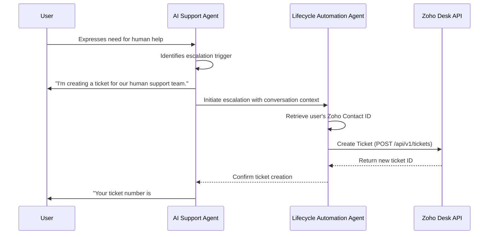

# Support Escalation to Zoho Desk Runbook

This document outlines the process for handling support escalations from the AI Support Agent to the human support team via Zoho Desk.

## 1. Escalation Triggers

The AI Support Agent will escalate a conversation to a human agent under the following conditions:

-   The user explicitly requests to speak to a human (e.g., "talk to a person," "I need more help").
-   The AI agent fails to understand the user's query after multiple attempts.
-   The user is expressing a high level of frustration or anger.
-   The user's issue is outside the scope of the AI agent's knowledge base (e.g., a complex billing issue, a legal question).

## 2. Escalation Process

## 3. Data Integrity

-   **Full Context**: It is critical that the full context of the conversation with the AI agent is included in the Zoho Desk ticket description. This allows the human agent to understand the issue without asking the user to repeat themselves.
-   **Contact Association**: The ticket must be correctly associated with the user's contact record in Zoho CRM. This is achieved by using the canonical ID mapping to find the user's `zoho_contact_id`.

## 4. Monitoring

-   The number of escalations to Zoho Desk is a key metric for the performance of the AI Support Agent. A high escalation rate may indicate that the AI agent's knowledge base needs to be improved or that there are recurring issues with the platform.
